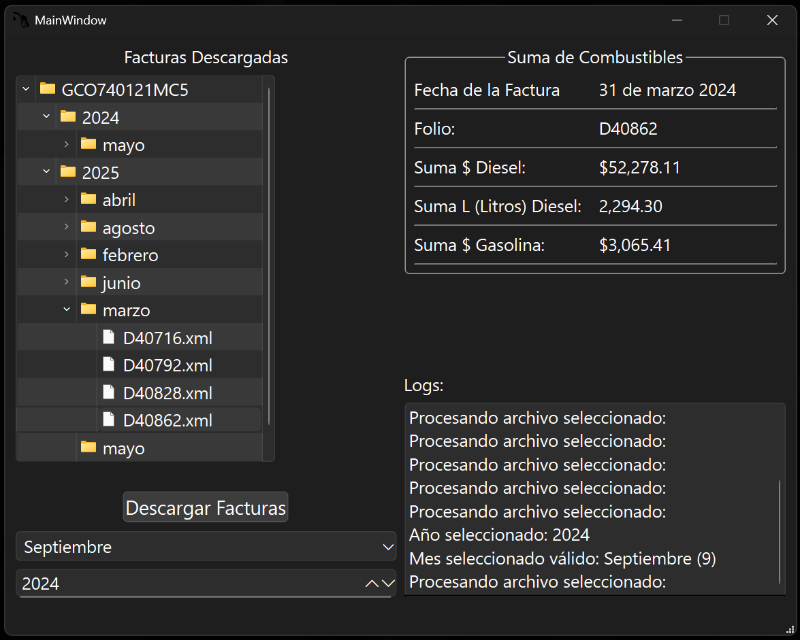

# FacturaDieselManager

**Version:** 1.0.0  
**Descripción:**  
FacturaDieselManager es una aplicación diseñada para descargar facturas del SAT de manera sencilla. Actualmente, esta versión está limitada a RFCs de 12 caracteres (empresas) y está personalizada para facturas de **Gasolinera Colón**.

---

## Interfaz de la Aplicación

*Vista principal mostrando el árbol de facturas organizadas por RFC/año/mes, resumen de combustibles y registro de actividad.*

---

## Características
- Descarga facturas automáticamente desde el SAT.
- No requiere archivos FIEL o clave privada.
- Optimizado para **Gasolinera Colón** (versión personalizada).
- Suma la cantidad de Litros Diesel y la cantidad que se pago por ella.
- Suma UNICAMENTE el precio de la gasolina.

### Próximas actualizaciones
- Soporte para RFCs personales (13 caracteres).
- Descarga de facturas para cualquier RFC.

